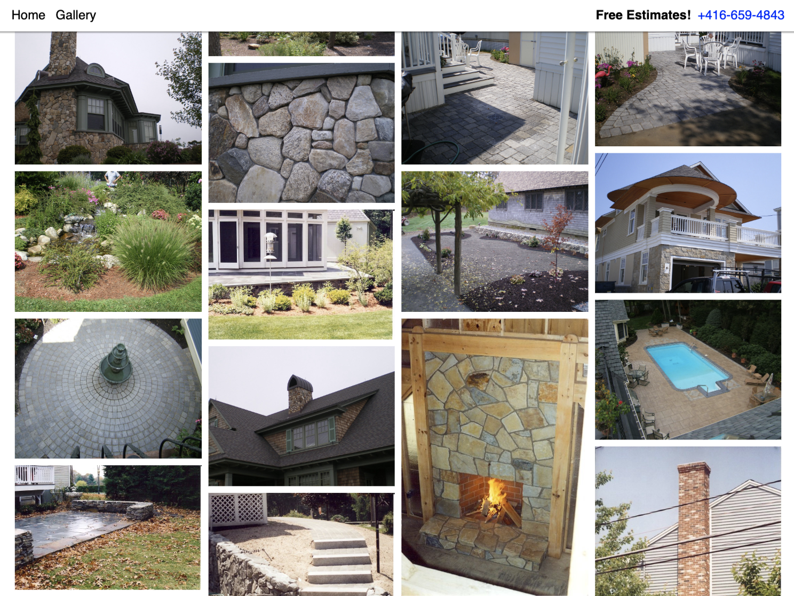
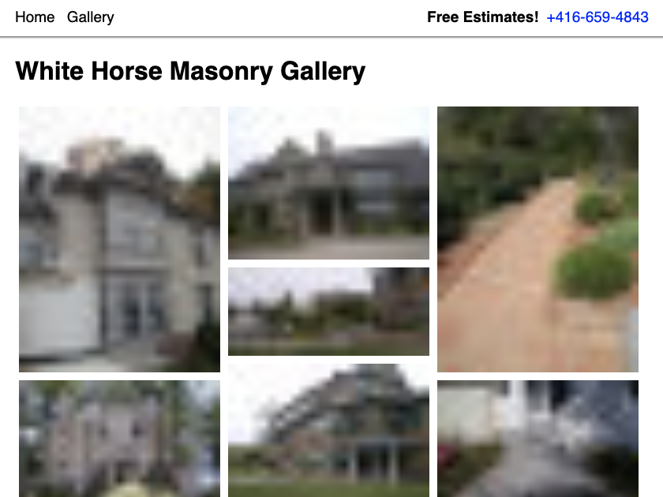
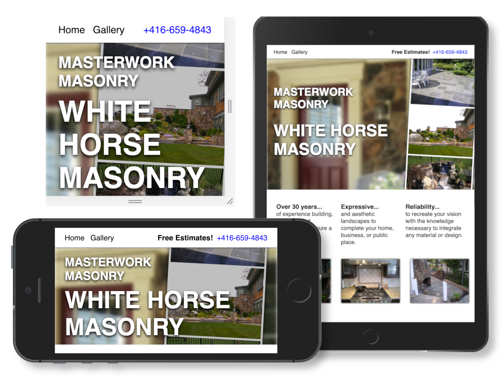
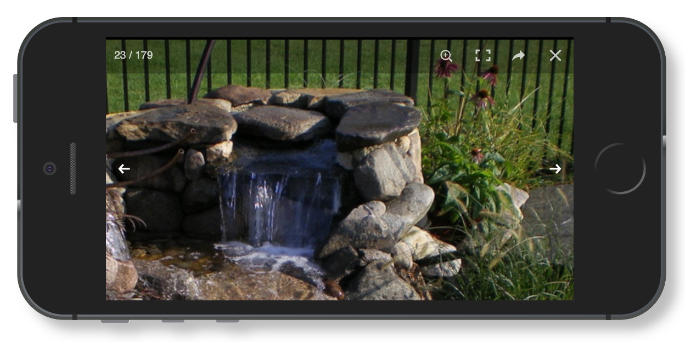

# White Horse Masonry Services
This was my first freelance website, a front-facing collection of work for a masonry company. This project is important to me because the  mason involved is my very own father. My father is an extraordinary mason with over 30 years of experience. I had to make sure that people see his work properly for how great it is.

Here is a link to the <a href="https://www.whitehorsemasonry.com" target="_blank">White Horse Masonry webpage</a> and another to the <a href="https://github.com/dyllandry/white-horse-masonry-services" target="_blank">project's GitHub repository</a>.

<figure class='image is-2by1' style="margin: 50px 0px;">
  
</figure>

## Design
When people visit a mason's website, their first thought will be to imagine the mason's work in front of their own home or business. This website was designed to afford that process by putting the mason's work up front and center. 

The visitor's *second* thought will be to consider this mason's work against the competition. This site's layout enables the work to speak for itself.

<figure class='image is-4by3' style="margin: 50px 0px;">
  
</figure>

## Benefits
### Always in touch
Assuming our client is interested, contacting White Horse Masonry (WHM) is always a clear and available action; Fixed to the top of every page is the company's phone number. Additionally on the home page is the company's email as well as a contact form.
### No Delays
Value diminishes over time. Whether it's a candy bar, a preordered Tesla, or ten dollars, we would always like it *now* rather than *later*. 

However, an image heavy site can take long to load. To remedy this issue, while the visitor waits for high resolution photos, low resolution images will take their place. When the higher resolution photo loads, the low resolution image is replaced.

<figure class='image is-4by3' style="margin: 50px 0px;">
  
</figure>

## Available to All Clients
Whether visitors are using their ultra widescreen desktops, old phones, their Apple watches, or iPads, the website is always presented as well as possible.

<figure class='image is-4by3' style="margin: 50px 0px;">
  
</figure>

## Implementation
### Webpack

<figure class='image is-128x128 is-pulled-right'>
  
</figure>

The WHM site could be static. That is, built from source files to a final distributed site. Whenever the site's content changes, either more photos added or the layout changed, the site must be rebuilt.

<a href="https://webpack.js.org" target="_blank">Webpack</a>, formally described as a module bundler, can facilitate the build process. Webpack is so powerful in part because it affords other developers a standard file input/output process for them to build plugins according to.

Two Webpack plugins I employed were particularly helpful.
- <a href="https://github.com/herrstucki/responsive-loader" target="_blank">Responsive loader</a>: Exports source images in multiple resolutions to better fit devices and reduce load times on slow networks. 
- <a href="https://github.com/jantimon/html-webpack-plugin" target="_blank">Html Webpack Plugin</a>: Responsible for bundling all processed resources into the final html files.

Further more, since a static site's output is only a set  files, the site is extremely easy to host. In this case, <a href="https://pages.github.com" target="_blank">GitHub Pages</a> provided free hosting.

### Image Gallery
The WHM image gallery is a critical component of their online presentation, and it was important that I got it right. That said, when you want something done right, *don't do it yourself*, and instead use another's developer's pre-packaged solution.

<a href="https://masonry.desandro.com" target="_blank">Masonry</a> is a widely used JavaScript grid layout library. Even <a href="http://iam.beyonce.com/tagged/my_work" target="_blank">Beyoncé</a> uses Masonry. If Masonry is good enough for Beyoncé, it's probably good enough for me.

<a href="https://photoswipe.com" target="_blank">PhotoSwipe</a> is a full screen viewer for photos. That is, you press on a photo, it grows to fit your screen, and provides a few extra controls like zooming in, moving horizontally between photos, and sharing links.

<figure class='image is-2by1' style="margin: 50px 0px;">
  
</figure>

## The Costs
I'd like to acknowledge what I've done poorly with this site. Because I believe it is okay to be ignorant, especially if you are aware of it.

> "There are known knowns; there are things we know we know. We also know there are known unknowns; that is to say we know there are some things we do not know. But there are also unknown unknowns — the ones we don't know we don't know."— Donald Rumsfeld

### Tedious to Update
I had two weeks to create this site. Leveraging the paternal relationship between the client and I, I've assumed they will contact me pesonally whenever content should be added to the site.

In retrospect, and assuming the potential absence of this paternal relationship, I would instead provide a content management system (CMS), like <a href="https://keystonejs.com" target="_blank">Keystone</a>, for the client to add their own images.

However, given the static build process already implemented, a server would be required to host the Keystone instance. Keystone can be configured to upload photos to Amazon Web Services (AWS) <a href="https://aws.amazon.com/s3/" target="_blank">Simple Storage Service</a> (S3). Then, maybe, a webhook could trigger Webpack rebuilds that would pull images from the same AWS S3 source and then push to the GitHub pages repository to finally update the site. I'd probably investigate that further.

But there might be simpler ways...

"Static site CMS" in Google revealed some simpler solutions like <a href="https://github.com/netlify/netlify-cms" target="_blank">Netlify</a>. So yes, there are simpler ways. Always research the unknown unknowns! 😅

### Development Time
A simple static site should not take two weeks to develop. Though, I do lend myself some slack since figuring out Webpack in that capacity took some time.

To speed up my development pace I would...
- Use a CSS framework. I'm definitely capable of producing custom and complex CSS, but in review that was not necessary for this website.
- Finalize a rough design before programming. Programming is used to implement a designed solution or feature. If it isn't yet designed than it's experimenting, and experimentation may not be what you want to spend your time doing, and your spare time redoing.

## Conclusion
Even though I'd like to add more to the site, after all a project is never done, I am happy with what I've made. Some parts are thrown together, but It manages to look nice and work well.

I think I made the important parts good, and the secondary parts okay, and the tertiary parts managable. Right now I really can't ask for more than that.